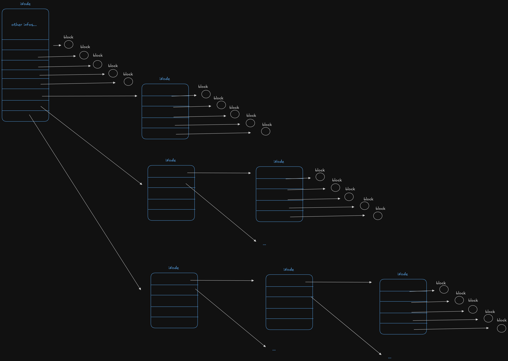

# Simulação do Sistema de Arquivos Utilizado Inode

**Universidade do Oeste Paulista**  
**Faculdade de Informática de Presidente Prudente**

**Título:** Simulação do Sistema de Arquivos Utilizado Inode

**Alunos:** Caio Collete Silva, Vinicius Messias Araujo, Nicolas Canassa e Higor Cerqueira
**Disciplina:** Sistemas Operacionais 2  
**Professor:** Robson Siscouto

---

## 1. Introdução

Este projeto tem como objetivo implementar um simulador completo de sistema de arquivos do tipo Unix utilizando inodes, desenvolvido em linguagem C. O simulador replica as funcionalidades fundamentais de um sistema de arquivos real, incluindo gerenciamento de blocos, diretórios, arquivos e comandos de usuário.

O sistema foi desenvolvido em cinco fases distintas, cada uma adicionando camadas de funcionalidade ao simulador:

- **Fase 1:** Gerenciamento do disco e blocos livres
- **Fase 2:** Lógica central do sistema de arquivos
- **Fase 3:** Interpretador de comandos (shell)
- **Fase 4:** Implementação completa dos comandos do usuário
- **Fase 5:** Sistema de relatórios avançados

O projeto demonstra os conceitos fundamentais de sistemas de arquivos, incluindo alocação de blocos, estrutura de inodes, gerenciamento de diretórios e implementação de comandos do sistema operacional.

---

## 2. Arquitetura e Estruturas de Dados

### 2.1 Estruturas Principais

O simulador utiliza cinco estruturas de dados principais, todas implementadas usando `struct` conforme as restrições do projeto:

#### 2.1.1 struct Inode

```c
struct Inode {
    char permissoes[11];      // Permissões: "-rwxr-xr--", "drwxr-xr--", "lrwxr-xr--"
    char data[11];           // Data da última modificação
    char hora[9];            // Hora da última modificação
    int tamanho_bytes;       // Tamanho do arquivo em bytes
    char nome_usuario[50];   // Nome do usuário proprietário
    char nome_grupo[50];     // Nome do grupo
    int contador_links;      // Contador para hard links
    int ponteiros[8];        // 5 diretos + 3 indiretos (simples, duplo, triplo)
};
```



**Propósito:** Representa o inode principal de um arquivo ou diretório. Os ponteiros implementam um sistema de alocação em três níveis: diretos (para arquivos pequenos), indireto simples (para arquivos médios), indireto duplo e triplo (para arquivos grandes).

#### 2.1.2 struct InodeExtensao

```c
struct InodeExtensao {
    int ponteiros[5];        // 5 ponteiros adicionais para blocos
};
```

**Propósito:** Extensão do inode para casos onde são necessários mais ponteiros do que os 8 disponíveis no inode principal.

#### 2.1.3 struct EntradaDiretorio

```c
struct EntradaDiretorio {
    char nome_arquivo[100];  // Nome do arquivo ou subdiretório
    int numero_inode;        // Número do bloco contendo o inode
};
```

**Propósito:** Representa uma entrada em um diretório, mapeando nomes de arquivos para seus respectivos inodes.

#### 2.1.4 struct Bloco

```c
struct Bloco {
    char tipo;               // 'F'=Livre, 'B'=Defeituoso, 'I'=Inode, 'A'=Arquivo/Diretório
    char dados[500];         // Array de 500 bytes para conteúdo
};
```

**Propósito:** Unidade fundamental do disco simulado. O campo `dados` é usado para armazenar diferentes tipos de estruturas (inodes, entradas de diretório, dados de arquivo) através de `memcpy`.

#### 2.1.5 struct NoPilha

```c
struct NoPilha {
    int numero_bloco;        // Número do bloco
    struct NoPilha* proximo; // Ponteiro para o próximo nó
};
```

**Propósito:** Implementa uma pilha usando lista encadeada para gerenciar blocos livres de forma eficiente.

### 2.2 Restrições e Soluções

**Restrição:** Não foi permitido o uso de `union` para diferentes tipos de dados no campo `dados` do bloco.

**Solução:** Utilizamos `memcpy` para converter entre estruturas C e dados brutos do bloco, permitindo que o mesmo campo `dados` armazene diferentes tipos de informação conforme necessário.

**Escolha da Pilha:** A pilha foi escolhida para o gerenciamento de blocos livres devido à sua simplicidade e eficiência para operações de alocação/liberação (LIFO - Last In, First Out).

### 2.3 Variáveis Globais

```c
struct Bloco* disco;                    // Array de blocos do disco
int NUMERO_TOTAL_BLOCOS;               // Tamanho total do disco
struct NoPilha* pilha_blocos_livres;   // Topo da pilha de blocos livres
int diretorio_atual;                   // Inode do diretório atual
char caminho_atual[512];               // Caminho atual do diretório
```

---

## 3. Implementação dos Comandos

### 3.1 mkdir - Criação de Diretórios

```c
void executar_mkdir_real(char* nome_dir) {
    // 1. Verificar se diretório já existe
    // 2. Alocar bloco para novo inode
    // 3. Inicializar inode com permissões "drwxr-xr-x"
    // 4. Alocar bloco de dados para o diretório
    // 5. Criar entradas "." e ".."
    // 6. Adicionar entrada no diretório pai
}
```

**Interação com estruturas:** O comando cria um novo inode (tipo 'I'), inicializa seus campos com valores padrão para diretório, aloca um bloco de dados (tipo 'A') e adiciona uma entrada no diretório pai usando `EntradaDiretorio`.

### 3.2 touch - Criação de Arquivos

```c
void executar_touch_real(char* nome_arquivo, int tamanho_bytes) {
    // 1. Verificar se arquivo já existe
    // 2. Alocar bloco para novo inode
    // 3. Inicializar inode com permissões "-rw-r--r--"
    // 4. Alocar blocos de dados conforme tamanho necessário
    // 5. Adicionar entrada no diretório atual
}
```

**Interação com estruturas:** Similar ao `mkdir`, mas o inode é configurado para arquivo regular e pode alocar múltiplos blocos de dados dependendo do tamanho especificado.

### 3.3 ls - Listagem de Conteúdo

```c
void executar_ls_real(bool longa) {
    // 1. Carregar inode do diretório atual
    // 2. Percorrer todos os blocos de dados do diretório
    // 3. Para cada EntradaDiretorio válida:
    //    - Carregar inode do arquivo/diretório
    //    - Exibir informações (nome, permissões, tamanho, etc.)
}
```

**Interação com estruturas:** Lê o inode do diretório atual, navega por seus blocos de dados, converte bytes para `EntradaDiretorio` e exibe informações dos arquivos.

### 3.4 link - Criação de Links

#### Link Físico (Hard Link)

```c
// 1. Encontrar inode do arquivo origem
// 2. Criar nova entrada no diretório destino
// 3. Incrementar contador_links do inode origem
```

#### Link Simbólico

```c
// 1. Criar novo arquivo no destino
// 2. Escrever caminho da origem como conteúdo
// 3. Marcar inode com permissão 'l' (link simbólico)
```

**Interação com estruturas:** Links físicos compartilham o mesmo inode (incrementam `contador_links`), enquanto links simbólicos criam novos inodes com conteúdo especial.

---

## 4. Sistema de Relatórios

O sistema implementa 8 relatórios distintos para análise e diagnóstico do sistema de arquivos:

### 4.1 Relatório 1: Blocos Ocupados por Arquivo

**Lógica:** Navega recursivamente por todos os ponteiros do inode (diretos e indiretos), contando blocos de dados ('A') e ponteiros ('I'). Utiliza array de controle para evitar loops infinitos.

### 4.2 Relatório 2: Tamanho Máximo de Arquivo

**Lógica:** Conta blocos livres na pilha e calcula o tamanho máximo teórico que um arquivo pode ter, considerando todos os níveis de indireção.

### 4.3 Relatório 3: Integridade dos Arquivos

**Lógica:** Percorre todos os arquivos do sistema e verifica se algum ponteiro aponta para blocos marcados como 'B' (defeituosos). Marca arquivos como "corrompidos" se encontrarem blocos ruins.

### 4.4 Relatório 4: Blocos Perdidos

**Lógica:** Cria array booleano para marcar blocos referenciados. Percorre toda a árvore de arquivos marcando blocos em uso. Identifica blocos ocupados ('I' ou 'A') que não foram marcados como referenciados.

### 4.5 Relatório 5: Estado Atual do Disco

**Lógica:** Percorre todo o array de blocos e exibe representação visual (50 blocos por linha) com legenda. Calcula estatísticas de uso por tipo de bloco.

### 4.6 Relatório 6: Visualização "Explorer"

**Lógica:** Função recursiva que recebe inode de diretório e nível de indentação. Lista conteúdo e chama a si mesma para subdiretórios, criando visualização em árvore.

### 4.7 Relatório 7: Árvore Detalhada

**Lógica:** Similar ao Explorer, mas inclui informações técnicas detalhadas (número do inode, número de blocos, permissões) para cada arquivo e diretório.

### 4.8 Relatório 8: Visualização de Links

**Lógica:** Percorre sistema identificando arquivos com `contador_links > 1` (links físicos) e arquivos com permissão 'l' (links simbólicos). Lista todos os caminhos que apontam para os mesmos inodes.

---

## 5. Dificuldades e Soluções

### 5.1 Problema do Fork()

**Dificuldade:** Inicialmente implementamos o shell usando `fork()` para cada comando, mas isso causava perda de estado do sistema de arquivos.

**Solução:** Removemos o `fork()` e executamos comandos diretamente no processo principal, mantendo o estado persistente do sistema de arquivos.

### 5.2 Navegação de Caminhos

**Dificuldade:** Implementar resolução correta de caminhos relativos com `..` e `.`.

**Solução:** Criamos funções especializadas para processar componentes de caminho, remover `..` e `.` corretamente, e reconstruir o caminho final.

### 5.3 Detecção de Loops Infinitos

**Dificuldade:** Evitar loops infinitos durante navegação recursiva de estruturas.

**Solução:** Implementamos arrays de controle (`bool* blocos_visitados`) para marcar blocos já processados.

### 5.4 Alocação de Múltiplos Blocos

**Dificuldade:** Implementar sistema de alocação com ponteiros indiretos simples, duplos e triplos.

**Solução:** Criamos funções recursivas que alocam blocos de ponteiros conforme necessário, seguindo a hierarquia de indireção.

---

## 6. Conclusão

Este projeto proporcionou uma compreensão profunda dos sistemas de arquivos Unix e sua implementação em baixo nível. Através da simulação de inodes, blocos e diretórios, foi possível entender:

- **Estrutura de inodes** e como eles organizam metadados de arquivos
- **Sistemas de alocação** com ponteiros diretos e indiretos
- **Gerenciamento de blocos** livres e ocupados
- **Implementação de comandos** do sistema operacional
- **Detecção de problemas** como corrupção e blocos perdidos

As principais dificuldades encontradas foram relacionadas ao gerenciamento de estado entre processos, navegação de caminhos complexos e implementação de estruturas recursivas. Todas foram superadas através de soluções robustas que mantêm a integridade do sistema.

O projeto demonstra a complexidade e elegância dos sistemas de arquivos modernos, mostrando como estruturas aparentemente simples (como blocos e inodes) podem criar um sistema completo e funcional de gerenciamento de arquivos.

---

## 7. Instruções de Compilação e Execução

### 7.1 Compilação

```bash
make clean
make
```

### 7.2 Execução

```bash
./simulador_arquivos
```

### 7.3 Comandos Disponíveis

```bash
ls [-l]                    # Listar conteúdo
mkdir <nome>               # Criar diretório
cd <caminho>               # Mudar diretório
touch <nome> [tamanho]     # Criar arquivo
rm <nome>                  # Remover arquivo
rmdir <nome>               # Remover diretório
link <origem> <destino>    # Criar link físico
link -s <origem> <destino> # Criar link simbólico
chmod <perm> <nome>        # Alterar permissões
bad <bloco>                # Marcar bloco como ruim
df                         # Mostrar uso do disco
pwd                        # Mostrar diretório atual
report <numero> [args]     # Gerar relatórios (1-8)
help                       # Mostrar ajuda
exit                       # Sair
```

### 7.4 Relatórios Disponíveis

```bash
report 1 <arquivo>    # Blocos ocupados por arquivo
report 2              # Tamanho máximo de arquivo
report 3              # Integridade dos arquivos
report 4              # Blocos perdidos
report 5              # Estado atual do disco
report 6              # Visualização Explorer
report 7              # Árvore detalhada
report 8              # Visualização de links
```

---

## 8. Arquivos do Projeto

- `main.c` - Função principal e inicialização
- `sistema_arquivos.h` - Definições de estruturas e protótipos
- `gerenciamento_disco.c` - Gerenciamento de disco e blocos livres
- `logica_central.c` - Lógica central do sistema de arquivos
- `demonstracao_fase2.c` - Funções de demonstração
- `shell_comandos.c` - Shell e interpretador de comandos
- `comandos_fase4.c` - Implementação dos comandos do usuário
- `relatorios_fase5.c` - Sistema de relatórios avançados
- `Makefile` - Configuração de compilação
- `README.md` - Documentação básica
- `README_COMPLETO.md` - Esta documentação completa

---

_Este projeto foi desenvolvido como parte da disciplina de Sistemas Operacionais, demonstrando os conceitos fundamentais de sistemas de arquivos através de uma implementação prática em linguagem C._
